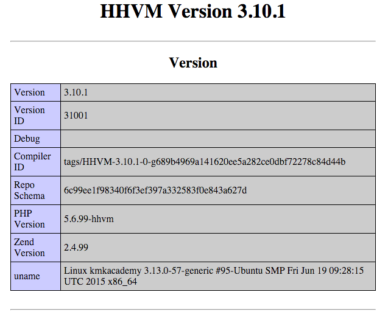
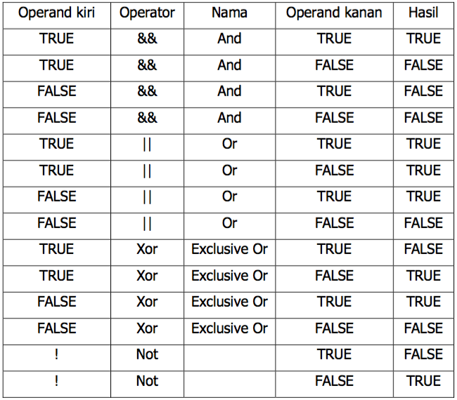

# HHVM #

## Apa itu HHVM ##

HHVM adalah singkatan dari HipHop Virtual Machine. Ini adalah suatu virtual machine yang bisa digunakan untuk menjalankan kode program PHP dengan lebih cepat. Selain bahasa pemrograman PHP, HHVM juga bisa menjalankan bahasa pemrograman Hack.

HHVM ini dibuat dan dimaintain oleh Facebook.

### Sejarah HHVM ###

Pada jaman dahulu, seiring dengan semakin besarnya Facebook, maka kebutuhan terhadap performance semakin mendesak. Untuk lebih mengoptimalkan penggunaan hardware, maka Facebook membutuhkan sesuatu yang lebih baik daripada `mod_php` yang biasa kita pakai.

Awalnya, Facebook mencoba mengkompilasi kode program PHP menjadi kode program C++, sehingga bisa lebih optimal memanfaatkan resource hardware. Akan tetapi setelah dipakai beberapa saat, programmer menjadi tidak produktif karena waktu kompilasinya lama. 

Selanjutnya, Facebook mencoba pendekatan berbeda, yaitu membuat interpreter, yang bisa menjalankan kode PHP langsung tanpa harus kompilasi. Kompilasi baru dilakukan setelah proses development selesai. Interpreter ini disebut dengan istilah HPHPi. Bersamaan dengan itu, dibuat juga debuggernya yang diberi nama HPHPd.

Seiring berjalan waktu, pendekatan kompilasi ternyata dipandang kurang efektif, karena ada satu langkah lagi sebelum kode program bisa dijalankan. Facebook akhirnya mengambil pendekatan Virtual Machine yang bisa langsung menjalankan kode program apa adanya. Inilah HHVM yang kita kenal sekarang ini.

### Keunggulan HHVM ###

Keunggulan utama tentu saja ada di sisi performance. Kalau kita cari di Google dengan keyword HHVM performance, tentu kita akan menemukan banyak orang yang sudah melakukan benchmarking. Tidak perlu kita kutip di sini, karena hasilnya selalu berubah. Inovasi HHVM akan diikuti oleh inovasi Zend engine dan Zephir, sehingga dari sisi performance, selalu berkejar-kejaran.

Keunggulan yang lebih penting adalah adanya bahasa Hack yang diciptakan oleh Facebook untuk berjalan di atas HHVM. 

### Hack Language ###

Bahasa pemrograman Hack adalah pengembangan dari bahasa PHP yang dibuat oleh Facebook. Ada beberapa penambahan fitur dibanding PHP, diantaranya:

* Type Annotation : kita bisa menulis tipe data untuk variabel dan return value dari method. Contohnya, bila biasanya di PHP kita menulis `var $a;`, maka di Hack, kita menulis `string $a;`
* Generics : kita bisa memberikan parameter untuk tipe data. Mirip dengan fitur generics di Java dan C#
* Tipe data null
* Collection : Set, Vector, Pair
* Lambda : memungkinkan function dijadikan parameter ke dalam function lain
* dan masih banyak lagi, yang bisa dibaca di websitenya http://hacklang.org

> Lho, kenapa pakai deklarasi tipe data? Nanti malah capek ngetik, kayak programmer Java.

Deklarasi tipe data, walaupun terlihat merepotkan, ternyata meningkatkan produktifitas pemrograman.

> Kenapa begitu?

Karena bila kita melakukan verifikasi tipe data di tahap kompilasi, error akan lebih cepat ditemukan daripada verifikasi pada waktu aplikasi dijalankan (runtime). Semakin cepat error kita temukan, semakin murah ongkos perbaikannya, karena kita masih ingat apa yang baru saja kita ketik. Bila error ini terbawa ke runtime, bisa jadi baru ditemukan berbulan-bulan kemudian. Pada saat itu, kita sudah lupa kapan kita tulis, mengapa kita tulis, apa relasinya dengan modul-modul lain, dan berbagai informasi lain yang penting untuk bisa memperbaiki error. 

Ada beberapa perubahan penting dalam Hack yang perlu kita ingat:

* Kode program Hack tidak bisa digabung dengan HTML
* File berisi kode program Hack diawali dengan `<?hh`
* File tidak perlu diakhiri dengan penutup tag `?>`
* Hack memiliki beberapa mode : partial, strict, mixed
* Bila tetap ingin memasang kode HTML, gunakan XHP

Baiklah, bahasa Hack lebih bagus, HHVM lebih kencang. Lalu bagaimana cara pakainya? Mari kita lanjutkan ke instalasi.

## Instalasi HHVM ##

Untuk menyederhanakan pembahasan, kita cuma akan membahas instalasi di Ubuntu 14.04.

Ada beberapa tahap dalam instalasi, yaitu:

* instalasi Nginx
* instalasi HHVM
* konfigurasi HHVM agar bisa dijalankan oleh Nginx
* test instalasi

### Instalasi Nginx ###

Nginx adalah aplikasi HTTP server yang nantinya bertugas menerima request HTTP dari client. Setelah request diterima, selanjutnya akan diserahkan kepada HHVM untuk dieksekusi. Hasil eksekusi dikembalikan kepada Nginx untuk diteruskan ke client.

Sebetulnya kita juga bisa pakai HTTP server lain seperti Apache atau lighttpd. Untuk menyederhanakan pembahasan, kita cuma bahas yang paling umum digunakan orang, yaitu Nginx.

Agar kita mendapatkan versi Nginx terbaru, kita tambahkan dulu PPA

```
sudo add-apt-repository -y ppa:nginx/stable
sudo apt-get update
sudo apt-get install -y nginx
```

Setelah selesai, Nginx akan bisa diakses di port 80. Coba test dengan membuka browser dan mengakses `http://alamat-ip-server/`.

### Instalasi HHVM ###

HHVM memiliki software repository sendiri, untuk itu kita perlu menambahkan public key dari repository tersebut

```
sudo apt-key adv --recv-keys --keyserver hkp://keyserver.ubuntu.com:80 0x5a16e7281be7a449
```

Setelah itu, kita tambahkan lokasi repository

```
sudo add-apt-repository "deb http://dl.hhvm.com/ubuntu $(lsb_release -sc) main"
```

Barulah kita lakukan instalasi

```
sudo apt-get update
sudo apt-get install hhvm
```

### Integrasi HHVM dengan Nginx ###

HHVM sudah membuatkan script untuk konfigurasi Nginx. Kita tinggal jalankan saja

```
sudo /usr/share/hhvm/install_fastcgi.sh
```

HHVM akan memeriksa apakah sudah ada Nginx atau Apache HTTPD yang sudah terinstal. Bila ditemukan, maka HHVM akan membuatkan konfigurasi untuk webserver tersebut.

### Test Instalasi ###

Untuk Ubuntu 14.04, secara default lokasi aplikasi web ada di folder `/var/www/html`. Jadi dalam folder inilah kita menaruh kode program kita. Ketikkan kode program berikut

```php
<?php phpinfo();
```

Simpan dengan nama `halo.php`. Selanjutnya, akses dari browser dengan alamat `http://ip-server/halo.php`

Bila instalasi berjalan benar, maka kita akan mendapatkan tampilan seperti ini



Instalasi selesai, berikutnya kita akan mempelajari dasar-dasar bahasa pemrograman Hack.

### Referensi ###

* https://blog.engineyard.com/2014/hhvm-hack
* http://fideloper.com/hhvm-nginx-laravel
* https://github.com/facebook/hhvm/wiki/Getting-Started
* https://github.com/facebook/hhvm/wiki/Prebuilt-Packages-for-HHVM

## Memahami Hack Language ##

Hack language adalah pengembangan dari PHP. Dengan demikian, sebagian besar konstruksi bahasanya sama. Bila kita sudah menguasai pemrograman PHP, maka tidak butuh waktu lama untuk bisa menguasai Hack.

Untuk menulis kode program Hack, perbedaan pertama dengan PHP adalah awalan file. Di PHP kita biasa menulis seperti ini

```php
<?php
```

Sedangkan di Hack, kita tulis seperti ini

```
<?hh
```
Selanjutnya, mari kita bahas seluk beluk pemrograman Hack yang lainnya. Bila ada yang berbeda dengan PHP, saya akan berikan penjelasan.

### Mode ###

Hack bisa dioperasikan dalam tiga mode:

* strict : semua tipe data harus dideklarasikan, baik dalam deklarasi variabel maupun deklarasi function dan parameternya
* partial : ini adalah mode default dalam Hack. Dalam mode ini, kita boleh mendeklarasikan tipe data, boleh juga tidak.
* decl : mode ini memungkinkan kita menulis dalam mode strict, tapi memanggil kode program yang ditulis tanpa deklarasi tipe data.

Mode dipasang di awal file, contohnya seperti ini

```php
<?hh // strict

class Pelanggan {
    private string $nama;
}

```

### Statement dan Comment ###

Statement di Hack sama dengan statement di PHP, yaitu diakhiri dengan tanda `;` seperti ini:

```php
echo("Halo Hack");
```

Sedangkan komentar ditandai dengan `//` untuk satu baris, serta pasangan `/*` dan `*/` untuk banyak baris. Contohnya seperti ini:

```php
// menampilkan tulisan Halo
echo("Halo");
```

dan ini

```php
/* kode program ini menampilkan
 * tulisan halo ke layar browser
 */
echo("halo");
```

### Variabel dan Tipe Data ###

Dalam masalah deklarasi variabel, Hack menambahkan fitur yang disebut **type annotations**, yaitu penulisan tipe data pada variabel. Bila di PHP kita mendeklarasikan variabel `x` seperti ini

```php
$x;
```

Maka dalam Hack, kita lakukan seperti ini

```php
int $x;
```

Hack menyediakan beberapa tipe data, yaitu:

* Tipe data sederhana

    * int : menyimpan bilangan bulat
    * float : menyimpan bilangan pecahan
    * string : menyimpan rangkaian huruf, angka, dan tanda baca
    * bool : nilai true atau false
    * array : kumpulan data dengan tipe data tertentu

* Tipe data gabungan

    * num : boleh diisi int maupun float
    * arraykey : boleh diisi integer atau string

* Tipe data lain-lain

    * mixed
    * void : bila suatu function tidak mengembalikan apa-apa
    * ?int, ?string, dan sejenisnya : bila variabel tersebut boleh null
    * tuple : kumpulan data yang immutable (sekali dibuat tidak bisa diubah). Yang tidak boleh diubah adalah struktur tuple (berapa isinya, tipe data masing-masing elemen), sedangkan isinya sendiri boleh diganti

Tipe data `array` hanya boleh dipakai dalam mode `partial` atau `decl`. Bila kita menjalankan Hack dalam mode `strict`, maka `array` tidak boleh dipakai. Kita harus pakai tipe data collection seperti `Vector`, `Map`, atau `Set`.

### Operator ###


Operator digunakan untuk memanipulasi nilai suatu variabel. Variabel yang nilainya dimodifikasi oleh operator disebut operand. Contoh penggunaan operator misalnya `13 - 3`. `13` dan `3` adalah operand. Tanda `-` disebut operator.

Untuk kemudahan penjelasan, operator diklasifikasikan menjadi :

* Arithmetic Operator
* Assignment Operator
* Comparison Operator
* Logical Operator
* Lain-lain


Arithmetic Operator digunakan untuk melakukan perhitungan matematika. Misalnya

```php
$a = 5 + 3;
```
Operator `+` berfungsi untuk menambahkan kedua operand (5 dan 3). 

Ada beberapa arithmetic operator, yaitu :

* `+` : penjumlahan - : pengurangan 
* `*` : perkalian
* `/` : pembagian
* `%` : nilai sisa pembagian


Relational operator digunakan untuk membandingkan nilai dari dua operand. Hasil perbandingan dinyatakan dalam nilai boolean. TRUE berarti benar, dan FALSE berarti salah.

Beberapa jenis relational operator :
* `==` : memeriksa apakah operand kanan bernilai sama dengan operand kiri
* `>` : memeriksa apakah operand kiri bernilai lebih besar daripada operand kanan
* `<` : memeriksa apakah operand kiri bernilai lebih kecil dengan operand kanan
* `>`= : memeriksa apakah operand kiri bernilai lebih besar atau sama dengan operand kanan
* `<=` : memeriksa apakah operand kiri bernilai lebih kecil atau sama dengan operand kanan
* `!=` : memeriksa apakah operand kanan tidak bernilai sama dengan operand kiri

Logical Operator digunakan untuk membandingkan dua nilai variabel yang bertipe boolean. Hasil yang didapat dari penggunaan logical operator adalah boolean.

Tabel logika berikut digunakan sebagai pedoman perhitungan




Assignment operator digunakan untuk memberi/mengisi nilai ke dalam variabel tertentu. Contoh sederhana :

```php
$nama = "endy";
```

Pada contoh di atas, operator "=" digunakan untuk mengisi nilai "endy" ke dalam variabel nama.
Selain operator "=", ada beberapa assignment operator yang lainnya, seperti dapat dilihat pada penjelasan berikut :

* Operator `+=` : Menambahkan nilai pada variabel

Contoh :
```php
$a += 3;
```
sama dengan
```php
$a = $a + 3;
```

Operator -= : Mengurangi nilai pada variabel 

Contoh :
```php
$a -= 3;
```
sama dengan
```php
$a = $a - 3;
```

Operator * : Mengalikan variabel dengan bilangan tertentu

Contoh :
```php
$a *= 3;
```
sama dengan
```php
$a = $a * 3;
```


Operator / : Membagi variabel dengan bilangan tertentu

Contoh :
```php
$a /= 3;
```
sama dengan
```php
$a = $a / 3;
```

Operator % : Mencari sisa hasil bagi variabel dengan bilangan tertentu

Contoh :
```php
$a %= 3;
```
sama dengan
```php
$a = $a % 3;
```

Operator & : Melakukan operasi logical AND pada variabel

Contoh :
```php
$a &= TRUE;
```
sama dengan
```php
$a = $a & TRUE;
```

Operator | : Melakukan operasi logical OR pada variabel

Contoh :
```php
$a |= FALSE;
```
sama dengan
```php
$a = $a | FALSE;
```

Operator ^ : Melakukan operasi bitwise xor pada variabel

Contoh :
```php
$a ^= 3;
```
sama dengan
```php
$a = $a ^ 3;
```


Operator . : Menambahkan String pada variabel

Contoh :
```php
$a .= “rudi”;
```
sama dengan
```php
$a = $a . “rudi”;
```

Operator + : Menambahkan nilai satu pada variabel

Contoh :
$a ++ ;
```
sama dengan
```php
$a = $a + 1;
```

Operator - : 
Mengurangi nilai satu pada variabel 

Contoh :
```php
$a -- ;
```
sama dengan
```php
$a = $a - 1;
```


### Percabangan  ###

Percabangan, atau sering disebut juga dengan istilah decision-making, memungkinkan aplikasi untuk memeriksa isi suatu variabel atau hasil perhitungan ekspresi dan mengambil tindakan yang sesuai. Ada dua jenis percabangan, dipilih berdasarkan kriteria pemeriksaan dan jumlah pilihan yang tersedia.

Seperti pada PHP, Hack memiliki dua jenis percabangan:

* if-else
* switch

Konstruksi if-else dapat dijelaskan sebagai berikut :

```php
if(condition){   
    // statement 1 
} else {   
    // statement 2 
}
// statement 3 goes here
```

Aliran program :

1. Condition akan diperiksa
2. Bila bernilai true, statement 1 akan dijalankan
3. Bila bernilai false, statement 2 akan dijalankan
4. Statement 3 dijalankan

Untuk pilihan yang lebih dari dua, PHP menyediakan konstruksi if-elseif- else.

```php
if(condition1){
     // statement 1
}
elseif(condition2){
     // statement 2
} else {
     // statement 3
}
// statement 4
```

Aliran program :
Ada 3 kemungkinan aliran program :   

Apabila condition 1 bernilai true :

1. Statement 1 dijalankan
2. Statement 4 dijalankan

Apabila condition 1 bernilai false, dan condition 2 bernilai true :

1. Statement 2 dijalankan
2. Statement 4 dijalankan

Apabila condition 1 dan condition 2 bernilai false :

1. Statement 3 dijalankan
2. Statement 4 dijalankan

Konstruksi switch dapat dijelaskan sebagai berikut :

```php
switch(a){
  case 1:
    // statement 1 goes here
    break;
  case 2:
    // statement 2 goes here
    break;
  case 3:
    // statement 3 goes here
    break;
  default:
    // statement 4 goes here
    break; 
}
// statement 5 goes here
```

Aliran program :

1. Variabel a diperiksa
2. Statement dieksekusi

    * Apabila a==1,statement 1 dijalankan 
    * Apabila a==2,statement 2 dijalankan
    * Apabila a == 3, statement 3 dijalankan
    * Apabila a tidak memenuhi 2a-2c, statement 4 dijalankan

3. Statement 5 dijalankan

Keyword break memegang peranan penting di sini. Fungsinya adalah mencegah fall-through, bandingkan dengan program berikut(break di baris ke 5 dihilangkan)

```php
switch(a){
    case 1:
    // statement 1 goes here
    case 2:
    // statement 2 goes here
    break;
    case 3:
    // statement 3 goes here
    break;
    default:
    // statement 4 goes here
    break; 
}
```

Aliran program :

1. variabel a diperiksa

    * Apabila a == 1, statement 1 dijalankan, kemudian menjalankan statement 2.
    * Apabila a == 2, statement 2 dijalankan
    * Apabila a == 3, statement 3 dijalankan
    * Apabila a tidak memenuhi 2a - 2c, statement 4 dijalankan

2. Statement 5 dijalankan

Perbedaan ada pada langkah 2a. Bandingkan dengan listing pertama.

### Looping ###

Ada dua bentuk perulangan pada Hack dan PHP:

* for
* while

Looping dengan for disebut juga determinate loop, artinya looping yang jumlah pengulangannya (iterasi) telah ditentukan di awal looping.

Ada beberapa bagian penting dari for loop:

* Initialization expression
* Stop condition
* Iterative expression
* Loop body

Initialization Expression dijalankan satu kali, pada saat looping dimulai. Biasanya bagian ini digunakan untuk menginisialisasi counter(penghitung). Stop condition diperiksa nilainya sebelum setiap iterasi dieksekusi. Apabila condition bernilai false, iterasi dihentikan. Iterative expression dilakukan setelah iterasi dieksekusi. Bagian ini biasanya digunakan untuk menambah nilai counter. Loop body dieksekusi sekali setiap iterasi, merupakan perintah yang ingin kita lakukan berulang-ulang.

While loop juga dikenal dengan istilah indeterminate loop, artinya jumlah loopingnya tidak ditentukan pada awal looping. while loop lebih sederhana daripada for loop, karena cuma memiliki dua bagian:

* Stop Condition
* Loop body

Stop condition diperiksa sebelum tiap iterasi dilaksanakan. Selama stop condition bernilai true, perintah dalam loop body akan dilakukan berulang-ulang. Iterasi akan dihentikan apabila stop condition bernilai false.
Sama seperti pada for loop, loop body dilaksanakan satu kali setiap iterasi.
Loop di atas akan berjalan terus tanpa henti, karena tidak ada perintah yang mengubah nilai stop condition.
do-while loop merupakan modifikasi dari while loop. Bentuknya dapat dilihat pada sampel kode berikut:

```php
do{
  // some statement
}
while (a == true)
```

### Function dan Lambda ###

Function adalah kumpulan beberapa statement yang dibuat dengan tujuan menyelesaikan satu tugas tertentu.

Perhatikan kode berikut :

```php
function add($a, $b){
  return $a + $b;
}
```

Function sederhana di atas akan menerima masukan berupa dua angka. Kemudian kedua angka tersebut akan dijumlahkan, dan hasilnya dikembalikan kepada pemanggil function.
Nilai yang dikembalikan tersebut disebut return value. Sedangkan nilai yang dimasukkan ke dalam function ($a dan $b) disebut parameter.

Ada beberapa hal utama yang perlu diperhatikan dalam deklarasi function pada PHP.

* nama function
* parameter
* function body

```php
1 function addNumber($x, $y) {
2   $z=$x+$y;
3   echo($z);
4 }
5
6 function jumlahkanlah($x, $y) {
7   $z=$x+$y;
8   return $z;
9 }
```

Perhatikan contoh function addNumber di atas.

Baris satu merupakan deklarasi function. deklarasi berisi : 

- keyword function
- nama function
- parameter

Parameter adalah nilai yang dimasukkan ke dalam function untuk diproses sehingga menghasilkan output.

Nama function ditentukan dengan memenuhi aturan sebagai berikut :
* Tidak boleh sama dengan function yang telah ada dalam PHP.
* Hanya boleh terdiri dari huruf, angka, dan garis bawah (underscore)
* Tidak boleh diawali dengan angka

Perhatikan baris 1 sampai 4.
* Function body dibatasi oleh sepasang { dan }
* Function body berisi instruksi yang harus dilakukan komputer untuk menghasilkan output yang diinginkan.
* Baris 2 menyuruh komputer untuk membuat satu variabel bernama z yang isinya adalah hasil penjumlahan x dan y.
* x dan y didapat dari input yang diberikan user.

Baris 3 menyuruh komputer untuk menampilkan hasil perhitungan ke layar.
Bedakan dengan baris 8 pada function jumlahkanlah yang memerintahkan komputer untuk menampilkan hasil perhitungan di layar

Function dalam HHVM dilengkapi dengan keterangan tipe data (type annotation). Berikut contoh versi HHVM untuk deklarasi function di atas

```php
1 function addNumber(int $x, int $y) : void {
2   int $z=x+y;
3   echo($z);
4 }
5
6 function jumlahkanlah(int $x, int $y) : int {
7   int $z=$x+$y;
8   return $z;
9 }
```

### Class dan Object ###

Class dan Object adalah dasar pemrograman berorientasi objek. Dengan class, kita mendefinisikan tipe data kita sendiri, sehingga kode program lebih mudah dibaca dan dipahami.

Sebagai ilustrasi, coba bandingkan penyimpanan data berikut ini

```php

// simpan data
$a["nama"] = "endy";
$a["email"] = "endy.muhardin@gmail.com";


// gunakan data secara benar
echo("Nama saya : " . $a["nama"]);
echo("Email saya : " . $a["email"]);

// ini sebetulnya salah, karena tidak ada data alamat, tapi tidak error
echo("Alamat saya : " . $a["alamat"]);
```

Bandingkan dengan bila kita mendefinisikan class seperti ini

```php
class Customer {
    string $nama;
    string $email;
}
```

Dari deklarasi class di atas, jelas bahwa seorang `Customer` hanya menyimpan dua data, yaitu `nama` dan `email`. Kita bisa mengisi data seperti ini

```php
$a = new Customer();
$a->nama = "endy";
$a->email = "endy.muhardin@gmail.com";
```

Dan bila kita mengakses data secara sembarangan, kita akan mendapat pesan error

```php
$a->alamat = "Jakarta"; // ini akan menimbulkan pesan error Undefined property
```

Class bisa berisi data/property dan juga function/method. Berikut contohnya

```php
class PenyimpananCatatan {
    
    public function __construct(protected string $namafile) : void {}

    public function simpan(string $catatan) : void {
        echo("Menyimpan $catatan ke $this->namafile");
    }
}
```

Kita bisa gunakan class di atas dengan membuat dulu objeknya, kemudian menggunakannya untuk menyimpan data ke file. Contohnya seperti ini

```php
$penyimpanan = new PenyimpananCatatan("/home/endy/notes.txt");

$penyimpanan.simpan("ini catatan saya");
```

Bila dijalankan, kode program tersebut akan menampilkan

```
Menyimpan ini catatan saya ke /home/endy/notes.txt
```


