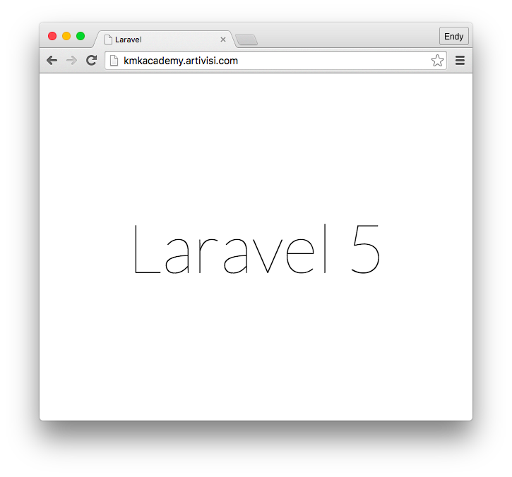

# Laravel #

## Apa itu Laravel ##

### Sejarah Laravel ###

### Cara Instalasi Laravel ###

Laravel diinstal dengan menggunakan Composer, yaitu package management yang ada dalam PHP. Untuk itu, kita perlu menginstal Composer terlebih dulu.

Composer sudah menyediakan script instalasi di websitenya. Kita tinggal unduh dan jalankan. Perintah unduh dan jalankan script instalasi bisa dilakukan dalam satu baris seperti ini:

```
curl -sS https://getcomposer.org/installer | php
```

Bila dijalankan, script di atas akan menginstal Composer di project tempat kita berada saja (local install). Untuk menginstal secara global di keseluruhan system, pindahkan file `composer.phar` ke folder `/usr/local/bin`. Extension `.phar` juga kita bisa hilangkan.

```
sudo mv composer.phar /usr/local/composer
```

Setelah composer terinstall, kita bisa langsung membuat project Laravel tanpa perlu melakukan langkah tambahan.


## Membuat Project dengan Laravel ##

Laravel sudah ada dalam package management Composer dengan nama `laravel/laravel`. Kita tinggal suruh Composer untuk membuat project baru.

### Membuat Project Baru ###

Project aplikasi helpdesk ini akan kita buat di dalam folder `/var/www`. Jadi, kita pindah dulu ke folder tersebut

```
cd /var/www
```

Project baru dibuat dengan perintah berikut

```
composer create project laravel/laravel aplikasiticket
```


Selanjutnya, kita konfigurasi Nginx supaya bisa menjalankan aplikasi tersebut. Buat file `aplikasiticket` di dalam folder `/etc/nginx/sites-available` dengan isi sebagai berikut

```
server {
	listen 80 default_server;
	listen [::]:80 default_server;

	root /var/www/aplikasiticket/public;
	index index.php index.html index.htm index.nginx-debian.html;

	server_name _;
	location / {
		try_files $uri $uri/ /index.php?$query_string;
	}
	include hhvm.conf;
}
```

Dalam file konfigurasi di atas, ada beberapa hal yang kita lakukan:

* Konfigurasi Nginx supaya berjalan di port 80
* Folder yang akan dipublish adalah `/var/www/aplikasiticket/public`, itu adalah folder di mana kita tadi membuat projectnya
* Tambahkan `index.php` sebagai default page
* Server kita bisa diakses dengan nama apa saja (`server_name _;`)
* Untuk mengaktifkan pretty URL, tambahkan konfigurasi `/index.php?$query_string`

Setelah konfigurasi selesai, kita bisa mencoba mengakses ke `http://namaserver-atau-ip`, dan kita akan mendapatkan tampilan seperti ini




### Membuat Tampilan Sederhana ###

### Menjalankan aplikasi ###

### Mendeploy aplikasi ke server ###

## Membuat Tampilan dengan Laravel ##

### Controller dan View ###

### Menubar dan Navigasi ###

### Form Input ###

### List View ###

### Login dan Logout ###

## Akses Database dengan Laravel ##


### Instalasi Database ###

Dalam buku ini, kita akan menggunakan database PostgreSQL versi 9. Untuk menginstalnya di Ubuntu, kita ketikkan perintah berikut

```
sudo apt-get install postgresql -y
```

Perintah di atas akan menginstall PostgreSQL versi terbaru, yaitu 9.3 pada saat tulisan ini dibuat.

Selanjutnya, ada sedikit konfigurasi jaringan yang perlu kita lakukan. Edit file `/etc/postgresql/9.3/main/pg_hba.conf` menjadi seperti ini

```
local   all         all                           password
host    all         all         127.0.0.1/32      password
host    all         all         ::1/128           password
```

Konfigurasi di atas memungkinkan kita login dengan menggunakan username dan password, sedangkan konfigurasi sebelumnya (bawaan Ubuntu) mengharuskan kita login menggunakan username dan password sistem operasi.

Setelah file tersebut diedit, kita perlu merestart PostgreSQL agar konfigurasi tersebut aktif.

```
sudo service postgresql restart 
```

Kita perlu membuat user database untuk aplikasi kita. Pertama, kita ganti dulu user sistem operasi dari `root` menjadi `postgres`.

```
su - postgres
```

Kemudian, gunakan perintah `createuser` dengan opsi `-P` agar kita bisa mengisi password dan opsi `--interactive` agar kita bisa menentukan ijin akses user yang akan dibuat.

```
createuser --interactive -P
Enter name of role to add: tiket
Enter password for new role:
Enter it again:
Shall the new role be a superuser? (y/n) n
Shall the new role be allowed to create databases? (y/n) y
Shall the new role be allowed to create more new roles? (y/n) n 
```

Setelah selesai, keluar dari user `postgres` dan menjadi user biasa. Lalu jalankan perintah `createdb` untuk membuat database baru. Gunakan user tiket yang baru saja kita buat dengan opsi `-U`

```
createdb -U tiket dbtiket
Password:
```

Kita sudah bisa membuka database `dbtiket` dengan user `tiket` dan password sesuai yang kita masukkan.

```
psql -U tiket dbtiket
Password for user tiket: 
psql (9.3.10)
Type "help" for help.

dbtiket=> \d
No relations found.
```

Database kita siap dipakai.

### Apa itu Eloquent ORM ###

### Desain skema database ###

### Konfigurasi koneksi database ###

### Mapping Eloquent Model ke Tabel Databaes ###

### Relasi One to Many dengan Eloquent Model ###

## Menggabungkan Tampilan dengan Akses Database ##

### Menampilkan data di tabel ###

### Menggunakan dropdown list ###

### Menyimpan data ke database ###

### Menyimpan data berelasi ke database

## Upload file ##

### Membuat Form Upload ###

### Lokasi penyimpanan hasil upload ###

### Menangani form upload ###

### Menampilkan hasil upload ###

## Security ##

### Skema database ###

### Implementasi Login ###

### Implementasi Logout ###

### Implementasi Ijin Akses ###


